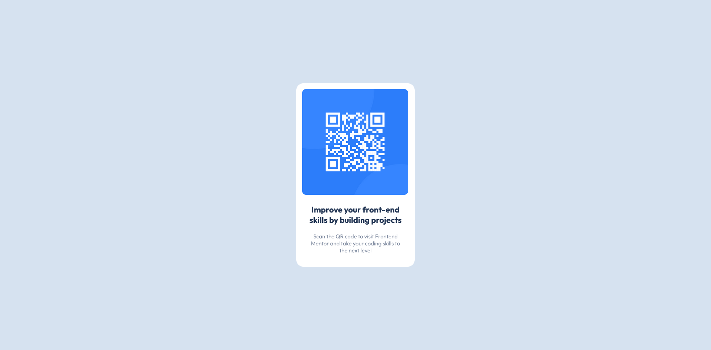

# Frontend Mentor - QR code component solution

This is a solution to the [QR code component challenge on Frontend Mentor](https://www.frontendmentor.io/challenges/qr-code-component-iux_sIO_H). Frontend Mentor challenges help you improve your coding skills by building realistic projects.

## Table of contents

- [Overview](#overview)
  - [Screenshot](#screenshot)
  - [Links](#links)
- [My process](#my-process)
  - [Built with](#built-with)
  - [What I learned](#what-i-learned)
  - [Continued development](#continued-development)
  - [Useful resources](#useful-resources)
- [Author](#author)
- [Acknowledgments](#acknowledgments)

## Overview

This is an attempted replication of the QR Component image. The submission was done as part of the Frontend Mentor challenge. This is my first challenge not only on Frontend Mentor, but any challenge. My HTML and CSS skills are quite untrained, and even on this basic challenge, extra research was necessary.

### Screenshot

### Links

- Solution URL: [Github Solution URL here](https://github.com/Devs-advocate/fem-challenge-qr_code.git)

## My process

### Built with

- Semantic HTML5 markup
- CSS custom properties
- Flexbox
- VS Code
  - Live Server
  - Emmet

### What I learned

- For this project, the CSS involved was best approached from the outside in.
- I re-inforced a lot of previously unpractised learning particularly with CSS.
- For centering, flexbox can be a useful tool.
- I applied custom properties (even though there wasn't a lot styling needed).
- I learned markdown basics.
- Taking on challenges is a great way of learning and cementing concepts.

### Continued development

More HTML/CSS practice is needed. Particularly for layouts and responsiveness. I'd also like to include SASS.

### Useful resources

- I used Stackoverflow for opinions on generally centering elements.
- Also w3schools for quick referencing of HTML tags and CSS properties.
- Screen Ruler from Microsoft Powertoys was heavily used to define pixel lengths.

## Author

- Frontend Mentor - [@Devs-advocate](https://www.frontendmentor.io/profile/Devs-advocate)

## Acknowledgments

YouTuber [Kevin Powell](https://www.youtube.com/@KevinPowell) informed me of the existence and usefulness of Frontend Mentor. I highly recommend that any needing CSS inspiration or help, check out his channel.
